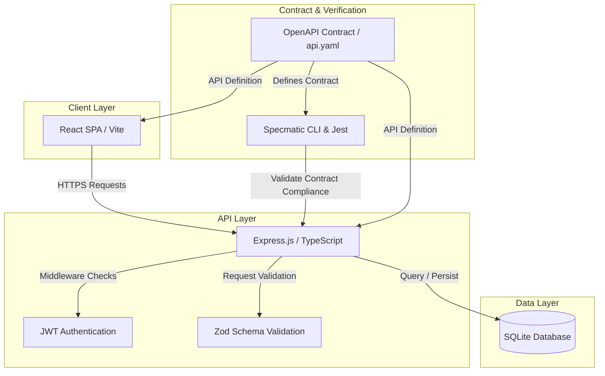

# Analytics Dashboard - Policy Data Platform

A full-stack analytics platform for India's policy data. The application visualizes demographic, census, tourism, health, education, and finance metrics using modern dashboards and automated insights.

---

## 🚀 Key Features

- **Monorepo Workspace:** Clean separation of React frontend and Node.js + Express backend inside a single repository with shared commands.
- **Interactive Visualizations:** Sleek dashboards that render and analyze Indian policy demographics, census, tourism, health, education, and finance metrics.
- **AI-Style Insights:** Automated generation of AI-styled synthesis, takeaways, and action items for individual policy categories.
- **Contract-First Design:** Fully validated API contract using Specmatic to align and verify the backend against the OpenAPI contract.

---

## 🏗️ System Architecture

The platform follows a decoupled, three-tier architecture structured inside a monorepo:

1. **Presentation Layer (Frontend):** A React Single-Page Application (SPA) that acts as the user interface, rendering interactive dashboards and handling document exports.
2. **Application Layer (Backend):** A TypeScript Node.js Express server that orchestrates business logic, JWT authentication, Zod input validation, and endpoints for data queries and AI-style insights.
3. **Data Layer (Database):** A self-contained SQLite file-based database containing demographic and analytics policy tables.

The communication is verified using **Contract-First development**, where the [api.yaml](file:///c:/Users/awant/OneDrive/Desktop/dena/dena/IIT/backend/contracts/api.yaml) contract validates both the backend code and mock interfaces.



---

## 💻 Tech Stack

### Frontend
- **Framework:** React 19 (JavaScript)
- **Routing:** React Router 7 (`react-router-dom`)
- **Build System:** Vite 7
- **Document Export:** `docx` (for generating Word reports)
- **Styling:** Vanilla CSS

### Backend
- **Language:** TypeScript 5
- **Runtime:** Node.js 20
- **Framework:** Express 4
- **Database:** SQLite 3 (handled via `sqlite` & `sqlite3`)
- **Validation:** Zod
- **Authentication:** JWT (`jsonwebtoken`) & `bcryptjs`
- **Documentation:** Swagger (Swagger UI Express + swagger-jsdoc)

### Contract Testing & Quality Assurance
- **Contract Driver:** Specmatic (v2.49.1) via [specmatic.yaml](file:///c:/Users/awant/OneDrive/Desktop/dena/dena/IIT/backend/specmatic.yaml)
- **Test Runner:** Jest (with `ts-jest` and `axios`)
- **CI/CD:** GitHub Actions

---

## 📁 Repository Structure

```
IIT/                                  ← monorepo workspace root
│
├── .github/
│   └── workflows/
│       └── specmatic-tests.yml       # CI pipeline: contract + workflow tests
│
├── package.json                      # Root workspace config (orchestrates scripts & dependencies)
├── README.md                         # Monorepo documentation
│
├── frontend/                         # React + Vite Frontend application
│   ├── src/                          # Components, pages, styles, assets
│   ├── public/                       # Static public assets
│   ├── package.json                  # Frontend configuration
│   ├── vite.config.js                # Vite build configuration
│   └── index.html                    # Main HTML entrypoint
│
└── backend/                          # Node.js + Express + TypeScript Backend API
    ├── src/                          # Controllers, models, routes, middlewares, config
    ├── contracts/                    # OpenAPI 3.0 API specification + external examples
    │   ├── api.yaml                  # OpenAPI spec (single source of truth)
    │   ├── api_dictionary.json       # Specmatic data dictionary for test generation
    │   └── api_examples/             # External Specmatic example files (12 scenarios)
    ├── workflow/                     # Arazzo workflow test definitions (for Enterprise)
    ├── specmatic.yaml                # Specmatic Config V3 
    ├── jest.config.js                # Jest configuration for contract tests
    ├── docker-compose.yml            # Docker Compose: backend + specmatic-test services
    ├── package.json                  # Backend configuration (includes specmatic, jest)
    └── tsconfig.json                 # TypeScript configuration
```

---

## ⚙️ How to Run Locally

### Prerequisites
- Node.js v18+
- Java JRE 17+ (required by Specmatic)

### 1. Install Dependencies
Run from the repository root:
```bash
npm install
```

### 2. Start Frontend & Backend
Run from the repository root to launch both servers concurrently:
```bash
npm run dev
```

### 3. Individual Workspace Commands (Optional)

#### Frontend
- Run dev server: `npm run dev:frontend`
- Build production: `npm run build:frontend`

#### Backend
- Run dev server: `npm run dev:backend`
- Build backend: `npm run build:backend`

---

## 🛠️ Specmatic Contract Testing

[Specmatic](https://specmatic.io) (open-source, v2.49.1) is used to validate the backend against the OpenAPI contract, generate resiliency tests, and run a multi-step user journey workflow. The configuration uses **Specmatic Config V3** (`specmatic.yaml`).

### Step 1 — Validate All Examples

Before running tests, verify that all inline and external examples in the contract are valid:

```bash
cd backend
npx specmatic examples validate --spec-file=contracts/api.yaml
```

Expected output:
```
Using dictionary file contracts/api_dictionary.json
All 8 example(s) are valid.  [Inline]
All 12 example(s) are valid. [External]
```

### Step 2 — Run Language-Native Jest Contract Tests (Recommended)

This is the **language-native integration** for this Node.js project. It starts the Express server programmatically using Jest, runs Specmatic contract tests inside the same process, and then executes a sequential **user journey workflow** (Login → Dashboards → Analytics → Insights):

```bash
cd backend
npm run test:contract
```

This runs `jest --config jest.config.js` which executes `src/scripts/specmatic-native.test.ts` with two test suites:

1. **Specmatic contract tests** — auto-generates test cases from `contracts/api.yaml` and validates every endpoint, status code, and schema.
2. **Sequential workflow** — simulates the real user journey: `POST /api/auth/login` → `GET /api/dashboards` → `GET /api/dashboards/{id}` → `GET /api/analytics/{category}` → `POST /api/insights` (CREATE → VIEW → VIEW → VIEW → CREATE).

### Step 3 — Run CLI Contract Tests

With the backend server running (`npm run dev:backend`), execute from the `backend/` directory:

```bash
cd backend
npx specmatic test --host=localhost --port=3000
```

Expected output:
```
100% API Coverage reported from 12 operations eligible for coverage
Tests run: 18, Successes: 18, Failures: 0
```

### Step 4 — Running with Docker Compose

The `backend/docker-compose.yml` includes both the backend service and a `specmatic-test` service that automatically runs contract tests against the backend using the official `specmatic/specmatic:2.49.1` open-source Docker image:

```bash
cd backend
docker compose up --exit-code-from specmatic-test
```

This will:
1. Build and start `dena-backend` on port `3000`.
2. Wait for the backend health check to pass.
3. Run `specmatic-test` (using `specmatic/specmatic:2.49.1`) with `test --host=dena-backend --port=3000`.
4. Exit with the Specmatic test result code.

---

## 🔄 Arazzo Workflow Testing

The Arazzo workflow file ([`workflow/DenaAnalyticsJourney.arazzo.yaml`](./backend/workflow/DenaAnalyticsJourney.arazzo.yaml)) defines the multi-step user journey:

> **Login → List Dashboards → Get Dashboard → Get Analytics → Generate Insights**

Arazzo workflow testing requires **Specmatic Enterprise**. The Arazzo file is included in this project for forward-compatibility and documentation purposes.

> [!IMPORTANT]
> Both **Specmatic Studio** (visual runner) and the **CLI Arazzo runner** are Enterprise-only features and are **not available** in the open-source `specmatic` npm package (v2.49.1) used by this project.

---

### Option A — Specmatic Studio (Enterprise only)

With a Specmatic Enterprise license, Studio provides a visual, browser-based interface to run and inspect Arazzo workflows step-by-step:

1. **Start the backend server:**
   ```bash
   cd backend
   npm run dev
   ```

2. **Start the Specmatic Enterprise Studio container:**
   Ensure Docker is installed and running, then execute the following command from the `backend/` directory:
   ```bash
   docker run --rm -it `
     -p 9000:9000 `
     -v ${PWD}:/usr/src/app `
     specmatic/enterprise:latest studio
   ```

3. **Open Specmatic Studio** in your browser:
   ```
   http://localhost:9000/_specmatic/studio
   ```

4. In the Studio **Test** tab:
   - Select **`workflow/DenaAnalyticsJourney.arazzo.yaml`** as the spec.
   - Click **▶ Run** to execute the full workflow sequence.

---

### Option B — CLI (Specmatic Enterprise)

If you have a Specmatic Enterprise license, run the workflow directly from the CLI:

```bash
cd backend
# Start the backend server first, then run:
npx specmatic test workflow/DenaAnalyticsJourney.arazzo.yaml --host=localhost --port=3000
```

> [!NOTE]
> This project uses Specmatic **Open Source** (v2.49.1) for all CI and automated tests. The Arazzo workflow file is included for forward-compatibility. Arazzo workflow tests require upgrading to Specmatic Enterprise.

---

## 📋 CI/CD — GitHub Actions

Every `push` and `pull_request` to `main` automatically runs contract **and resiliency** tests:

1. Installs Node.js 20 + Java 17 (required by Specmatic).
2. Installs all dependencies and builds the TypeScript backend.
3. Validates all Specmatic examples (`npx specmatic examples validate`).
4. Runs the language-native **Jest contract & workflow tests** with **generative (resiliency) tests enabled** via `SPECMATIC_GENERATIVE_TESTS=true`.
5. Starts the backend server and runs full **CLI Specmatic contract tests** — including negative/boundary test generation via `SPECMATIC_GENERATIVE_TESTS=true` — against the live server.
6. Uploads the Specmatic HTML test report as a build artifact.

See [`.github/workflows/specmatic-tests.yml`](.github/workflows/specmatic-tests.yml) for the full pipeline definition.

